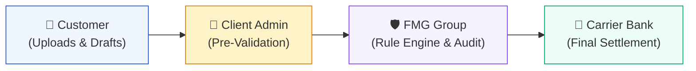
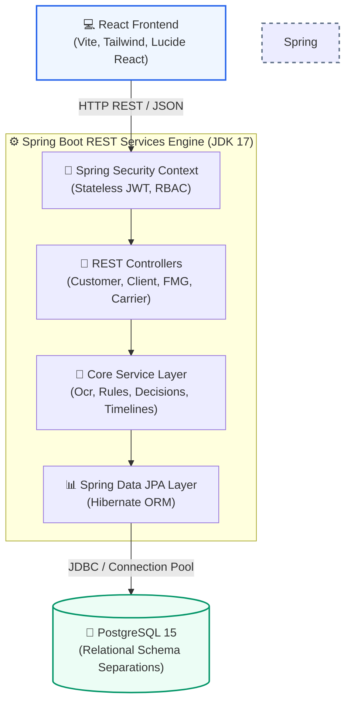
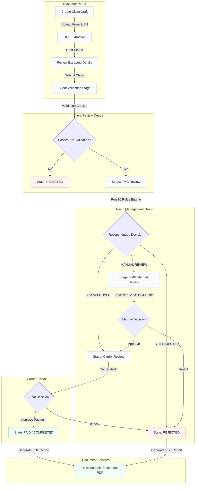
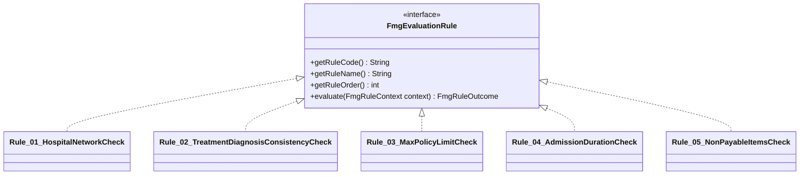
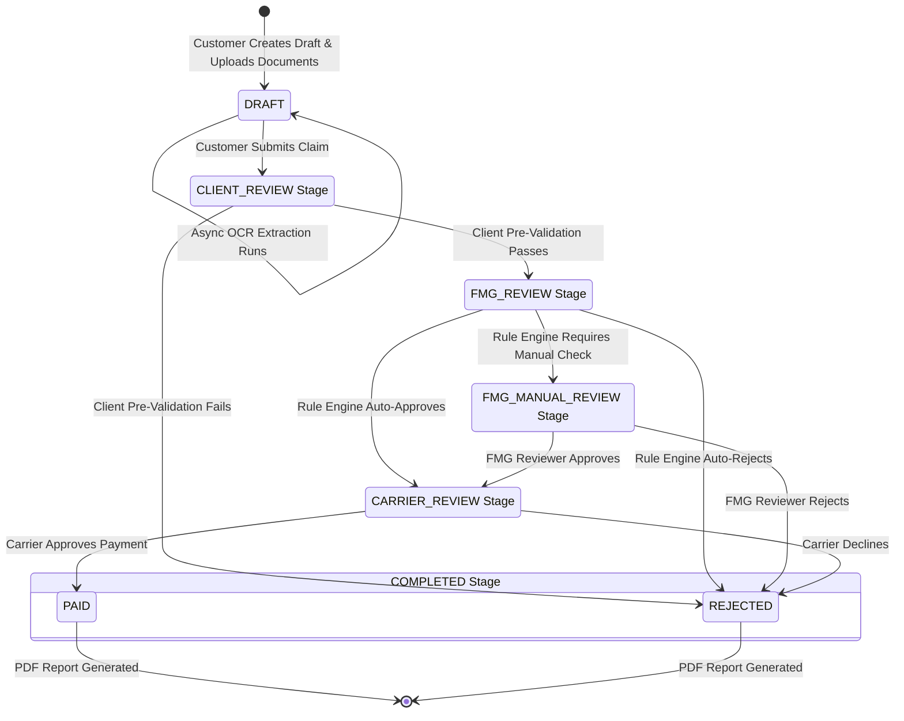
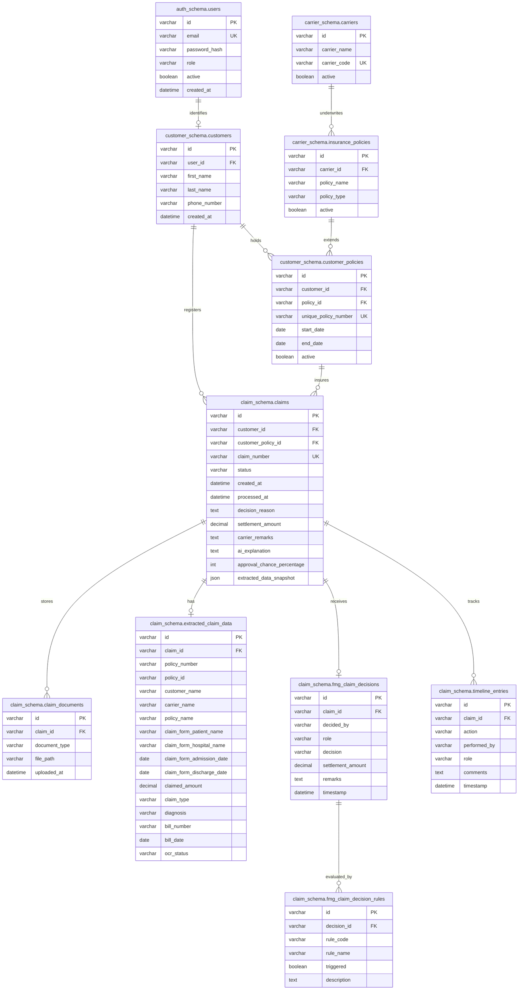

# Enterprise TPA Insurance Claim Processing System
### Combined High-Level Design (HLD) & Low-Level Design (LLD) Blueprint

This document serves as the comprehensive architecture blueprint, HLD, and LLD guide for the **Third-Party Administrator (TPA) Insurance Claim Processing System**. This system is an enterprise-grade platform designed to streamline, automate, and audits the end-to-end lifecycle of medical insurance claims between Customers, Client Administrators, Fraud Management Groups (FMG), and Carrier Underwriters.

---

## 📖 Table of Contents
1. [System Overview & Business Domain](#1-system-overview--business-domain)
2. [Technology Stack](#2-technology-stack)
3. [High-Level Design (HLD) Architecture](#3-high-level-design-hld-architecture)
   - [Unified Flow & HLD Diagram](#unified-flow--hld-diagram)
   - [Database Schemas & Multi-Tenant Separation](#database-schemas--multi-tenant-separation)
4. [Low-Level Design (LLD) Module Specifications](#4-low-level-design-lld-module-specifications)
   - [Auth & Security Module](#auth--security-module)
   - [OCR & Data Extraction Module](#ocr--data-extraction-module)
   - [Client Validation Module](#client-validation-module)
   - [FMG Rule Engine Core](#fmg-rule-engine-core)
   - [FMG Manual Review Module](#fmg-manual-review-module)
   - [Carrier Settlement Module](#carrier-settlement-module)
   - [PDF Generator & Reporter Module](#pdf-generator--reporter-module)
5. [Claim State Machine Flow Diagram](#5-claim-state-machine-flow-diagram)
6. [Database Architecture & Entity Relationships (ERD)](#6-database-architecture--entity-relationships-erd)
7. [Local Deployment & Execution Guide](#7-local-deployment--execution-guide)

---

## 1. System Overview & Business Domain

TPAs act as critical intermediaries in the insurance ecosystem. They process healthcare claims on behalf of insurance carriers or self-insured employers, ensuring claims are valid, within policy boundaries, fraud-free, and paid accurately.

### The Four Core Personas

We define four distinct actors within the TPA ecosystem, each playing a vital role in completing a claim's lifecycle:

| Persona | Responsibility | Main UI Features |
| :--- | :--- | :--- |
| **👤 Customer** | Registers medical drafts, uploads documents, verifies extracted OCR data, and monitors claim progress. | Claim Submission, OCR Review Panel, PDF Report Download |
| **💼 Client Admin** | Represents the primary employer/insurer. Pre-validates basic credentials and policy boundaries. | Active Pre-Validation Queue, Policy Verification Grid |
| **🛡️ FMG (Fraud Group)** | Fraud Management Group. Performs automated audit rule analysis and manual checklists. | Auto-Trigger Diagnostics, Rule Engine Catalog, Checklists |
| **🏦 Carrier Underwriter** | The insurance carrier/bank. Audits the finalized file and releases the cash disbursement. | Settlement Console, Disbursement History |



---

## 2. Technology Stack

This system is built using modern, enterprise-ready technologies designed for high performance, maintainability, and security.

### Backend ⚙️
- **Java 17 (JDK 17)**: Core language.
- **Spring Boot 3.3**: Framework for REST APIs, dependency injection, and auto-configuration.
- **Spring Security**: Role-Based Access Control (RBAC) and Stateless JWT authentication.
- **Spring Data JPA & Hibernate**: ORM for relational database interaction.
- **OpenPDF**: High-fidelity PDF generation engine for settlement reports.
- **Google Cloud AI Studio Client (Gemini)**: API integration for OCR and document data extraction.

### Frontend 💻
- **React 18**: Core UI library.
- **Vite**: Ultra-fast frontend build tooling.
- **Tailwind CSS**: Utility-first CSS framework for custom styling and responsive design.
- **Lucide React**: Crisp, modern icon set.

### Database & Infrastructure 🐘
- **PostgreSQL 15**: Relational database with multi-schema architecture for robust data isolation.
- **Docker & Docker Compose**: Full-stack containerization for reproducible environments and easy deployment.
- **Alpine Linux**: Minimal OS base images to reduce container footprint and improve security.

---

## 3. High-Level Design (HLD) Architecture

The application is built upon a **highly scalable, decoupled multi-tier architecture** containerized with Docker.



### Unified Flow & HLD Diagram

This flow diagram illustrates how claims transition dynamically through systems and state machines:



### Database Schemas & Multi-Tenant Separation

PostgreSQL uses modular schema groups to separate operational units securely:

| Schema Name | Responsibility | Key Tables Included |
| :--- | :--- | :--- |
| **`auth_schema`** | Stores access control registry and credentials. | `users`, `roles_mapping` |
| **`claim_schema`** | Manages high-frequency transactional data and audit chains. | `claims`, `claim_documents`, `extracted_claim_data`, `client_claim_validations`, `fmg_claim_decisions`, `fmg_manual_reviews`, `timeline_entries` |
| **`carrier_schema`** | Holds master policy structures and insurance parameters. | `carriers`, `insurance_policies` |
| **`customer_schema`** | Maintains personal profiles, identifiers and coverage bindings. | `customers`, `customer_policies` |

---

## 4. Low-Level Design (LLD) Module Specifications

### Auth & Security Module
- **Technology**: Spring Security, JWT (Stateless authentication tokens).
- **Core Classes**: 
  - `JwtAuthenticationFilter`: Extracts JWTs from incoming requests, validates them, and registers authentication states into Spring's Security Context.
  - `TpaUserPrincipal`: Stores user identities, roles, and mapping parameters (e.g., Customer profiles).
- **Endpoint Protection Pattern**: Role-Based Access Control (RBAC) configured globally in `SecurityConfig.java`:
  - `/customer/**` ── Restricted to users with `ROLE_CUSTOMER`.
  - `/client/**` ── Restricted to users with `ROLE_CLIENT`.
  - `/fmg/**` ── Restricted to users with `ROLE_FMG`.
  - `/carrier/**` ── Restricted to users with `ROLE_CARRIER`.

---

### OCR & Data Extraction Module
- **Core Service**: `ClaimOcrProcessingService`
- **Design Pattern**: Event-driven asynchronous execution. When a customer uploads claim documents, a `ClaimOcrRequestedEvent` is dispatched. 
- **OCR Engine**: Orchestrates file analysis via Gemini AI Studio Client or fallbacks. It parses text models of claim forms and medical bills, extracting structural parameters:
  - Policy numbers, Patient and Customer Names, Diagnoses, Hospital Registries, Total Bill & Claimed Amounts.
- **Result Schema**: Saves results in the `claim_schema.extracted_claim_data` entity linked to the Claim, with an `ocr_status` status tag (`PENDING` -> `COMPLETED`/`FAILED`).

---

### Client Validation Module
- **Core Service**: `ClientClaimReviewService`
- **Validation Engine**: Performs cross-referencing between the policy data stored in database and raw parameters parsed by the OCR engine.
- **Rules Verified**:
  - Customer name match, Policy number match, Active status validation.
- **Outcome Database Entity**: `ClientClaimValidation` (stores the JSON validation array and `validation_status`). If validation succeeds, the claim is promoted to the `FMG_REVIEW` stage.

---

### FMG Rule Engine Core
- **Core Service**: `FmgRuleEngineService` & `FmgRuleContextFactory`
- **Design Pattern**: Open-Closed Principle (OCP) Catalog. Individual rule implementations inherit from a base `FmgEvaluationRule` class:



#### Rule Catalogue (10 Evaluation Criteria)
1. **Hospital Network Status Check**: Flags if the hospital is out-of-network.
2. **Treatment-Diagnosis Consistency**: Flags mismatches between the primary medical diagnosis and treatments/procedures billed.
3. **Maximum Limit Verification**: Flags claims where the requested amount exceeds policy ceilings.
4. **Admission Length Check**: Verifies if the hospital admission length matches normal durations for the diagnosis.
5. **Non-Payable Item Audit**: Detects non-covered expenses (consumables, hygiene products) hidden in bills.
6. **Timeline Overlap Check**: Verifies the patient does not have other overlapping active claims.
7. **Age-Policy Verification**: Validates the patient's age meets policy provisions.
8. **Duplicate Bill Check**: Flags bills with duplicate invoice numbers or dates.
9. **Waiting Period Check**: Flags claim diagnoses falling under exclusion waiting periods.
10. **Pre-Existing Conditions check**: Flags conditions excluded under policy criteria.

- **Auto-Confirm Flow**: If rules evaluate successfully to a clear recommendation (`APPROVED` / `REJECTED`), the frontend automatically executes the final FMG decision confirmation payload, skipping manual steps and expediting the claim.

---

### FMG Manual Review Module
- **Core Classes**: `FmgManualReview`, `FmgManualReviewPanel`
- **Workflow Exception Handlers**: If rules trigger a `MANUAL_REVIEW` recommendation (e.g. out-of-network hospital with an emergency condition), the claim is routed to the `FMG_MANUAL_REVIEW` queue.
- **Reviewer Layout**: Shows FMG reviewers an interactive, rule-by-rule status checklist (pass/fail states) and requires manual confirmation with reviewer justification notes.

---

### Carrier Settlement Module
- **Core Service**: `CarrierClaimReviewService`
- **Disbursement Release**: Final stage interface for the Insurance Carrier. The Underwriter reviews the audited ledger, the client validation logs, and the FMG checklist, then triggers either:
  - `PAID` (which completes the claim lifecycle).
  - `REJECTED` (which issues a carrier decline).

---

### PDF Generator & Reporter Module
- **Core Service**: `ClaimReportPdfService`
- **Aesthetic Engine**: **OpenPDF (LibrePDF)** with a highly polished design.
- **Styling Architecture**: Includes a custom corporate header, color-coded outcome boxes (green for payment, red for decline), and structured timeline grids.
- **Deep-Diagnostics Extraction**: If a claim is in `REJECTED` status, the generator runs a deep search across upstream entities to output the **precise primary cause** inside a clean PDF panel:
  - **Automated Rule Engine Failures**: Identifies the specific rule code, rule name, and system explanations.
  - **Manual FMG Overrules**: Outputs the exact manual notes, author, and timestamp.
  - **Client Validation Mismatches**: Outputs pre-validation failures and review metrics.
  - **Carrier Declines**: Explains bank/underwriter settlement decisions.

---

## 5. Claim State Machine Flow Diagram

This flow diagram illustrates the dynamic state and stage transitions a claim goes through from creation to final settlement:



---

## 6. Database Architecture & Entity Relationships (ERD)

This entity relationship diagram displays the core database architecture with high-fidelity detail, showing data types, primary/foreign keys, and cross-schema connections:



---

## 7. Local Deployment & Execution Guide

The environment runs fully containerized.

### 1. Prerequisites
- **Docker & Docker Compose**
- **Git**

### 2. Configuration (`.env`)
Create a `.env` file from the example:
```bash
cp .env.example .env
```

### 3. Execution Commands

To build and spin up the complete, secure environment:
```bash
# Spin up all Postgres, Backend and React Frontend instances
docker compose up --build -d
```

To stop all active services and maintain the volume maps:
```bash
docker compose down
```

To review system execution metrics or analyze Spring boot start threads:
```bash
docker compose logs -f backend
```

---
> **Corporate Notice**: This architecture is confidential and designed for the Third-Party Administrator Insurance System. All schema mappings, rules metrics, and database structural assets are protected.
